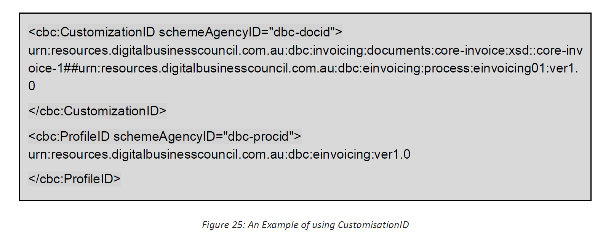

# 10 Identifying Services for the Interoperability Framework (Normative) 

Within the Framework businesses register their capability to receive specific Documents as defined for specific business processes - known as Services. 

For eInvoicing there are three processes defined (Invoicing, Recipient Created Tax Invoicing and Adjustment Invoicing). These may be used in conjunction with the Response process. 

Within the Council’s Interoperability Framework a business may register its capability to receive Documents based on these Services (Digital Business Council, 2016b). The possible Values for these Identifiers are listed in Table 5. 

| | | | |
| --- |------- | --- |------- |
**Service Name** |**Exchange (transactions)**|**CustomizationID or Process ID (See 10.2)**| **ProfileID or DocTypeID (See 10.2)**| 
Invoicing | Buyer can receive an eInvoice | Invoicing01-1 | Core-Invoice-1 | 
Recipient Created Tax Invoicing | Supplier can receive an RCTI eInvoice | Invoicing02-1 |Core-Invoice-1 |
Adjustment Invoicing | Buyer can receive an eInvoice | Invoicing03-1 | Core-Invoice-1 |
| |Buyer can receive an Adjustment eInvoice | |Core-Invoice-1 | 
Response | Supplier can receive a Response | Invoicing04-1 | Response-1 |

To receive Documents using the Framework requires a business to register one Service only. Registering the capability to support other Services is entirely optional. 

For example, if a Buyer is wishes to acknowledge receiving an eInvoice Document with a Response Document they can only do so if the Supplier is registered for the appropriate Service (in this case, ‘Invoicing04-1’ and ‘Response-1’). 

## 10.1 Document Identification 

To identify a Document when used within the Framework some additional Elements are applicable. These are listed in Table 6. 

*Table 6: Document Identification Elements*

| | | | |
| --- |------- | --- |------- |
**Information Element** |**Definition**|**Scheme Agency**| **Value**| 
UBLVersionID | Identifies the earliest version of the UBL 2 Schema for this Document type. | N/A | 2.1 |
CustomizationID | Identifies a user-defined customization of UBL for a specific use. | @schemeAgencyID=’dbc-au’ | See Table 5 DocTypeID (above). |
ProfileID | Identifies a user-defined profile of the customization of UBL being used. | @schemeAgencyID=’dbc-au’ | See Table 5 ProcessID (above). |
ProfileExecutionID | Identifies an instance of executing a profile, to associate related transactions within a business collaboration. | N/A | Determined by the business transaction |

## 10.2 Identifying Services and Documents 

The XML Document Elements known as CustomizationID and ProfileID are the means of aligning a UBL Document with the ProcessID and DocTypeID of the Council’s eDelivery Services. The Values for the eInvoicing processes are given in Table 5. These identifiers are prefixed with the namespace of the relevant artefacts (see Section 11). 

Implementers may use the Values in these UBL Elements to validate that the correct Document is being sent (or has been delivered) to the correct Endpoint. 

An example of how these would appear in an UBL Document is given in Figure 25 below. 

