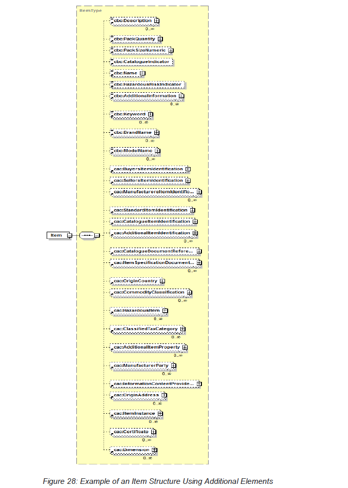
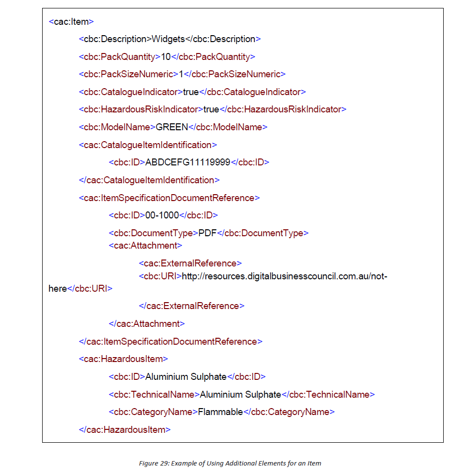
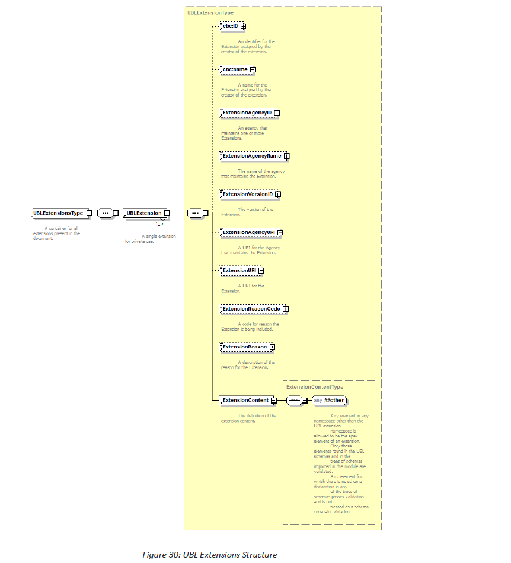
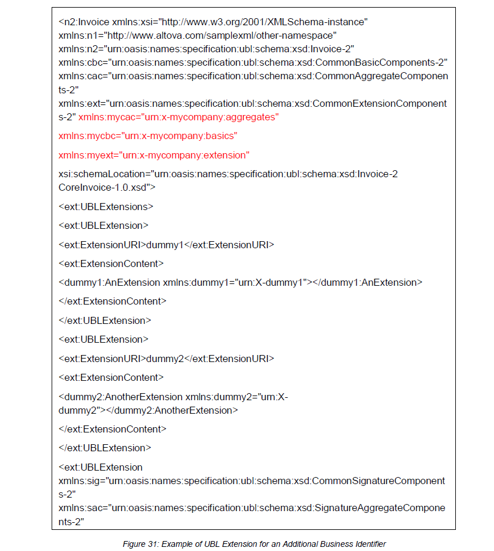

# ANNEX A: Examples of Extensions 

## A1: Extension Using the UBL Library 

Additional UBL Library Elements can simply be added by engaging then from the common library. 

Extended eInvoice Documents can be validated against an extended Core Invoice Schema or the general UBL Schema (OASIS UBL Invoice, 2013). 

In this example, a set of additional UBL Elements are being engaged to provide more information about an Item (Figure 28). 

## A2: Extension Using the UBLExtensions Element 

The standard UBL Schema provides an UBLExtensions Element that allows any type of content to be included inside the eInvoice and remain conformant to the Core Invoice Schema. For more information see the UBL Extension Validation Methodology (OASIS UBL Extensions, 2013). 

Processing information contained inside the UBLExtensions Element should be based on prior agreements between trading partners. These may be specified as new Services and registered as capabilities in the Framework. 

Figure 30 describes the structure of the UBL Extension Element. 

In the following example (Figure 31), an additional type of business identifier is described inside an eInvoice Document. 

