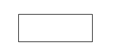
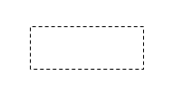
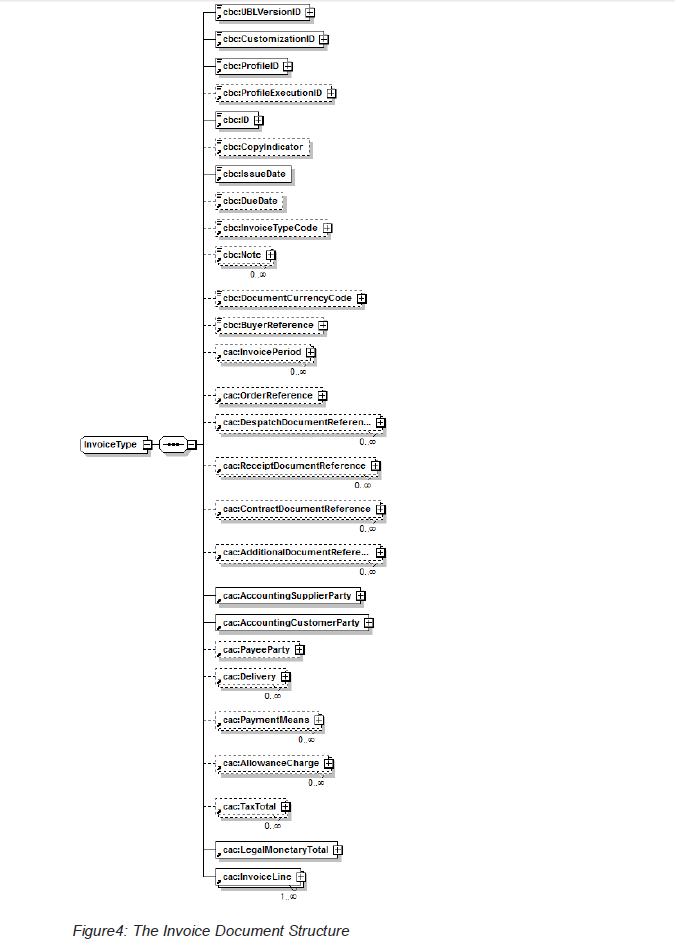
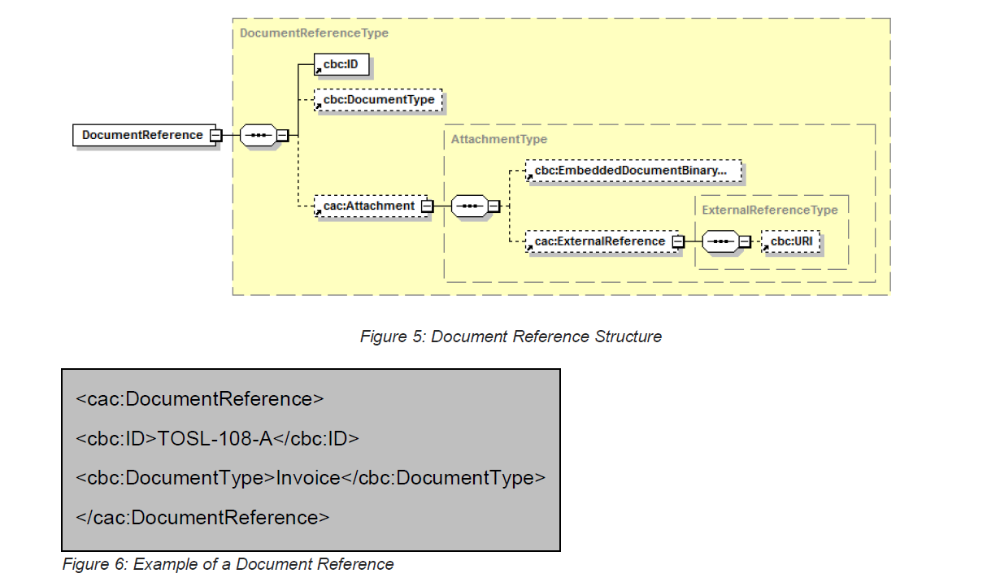
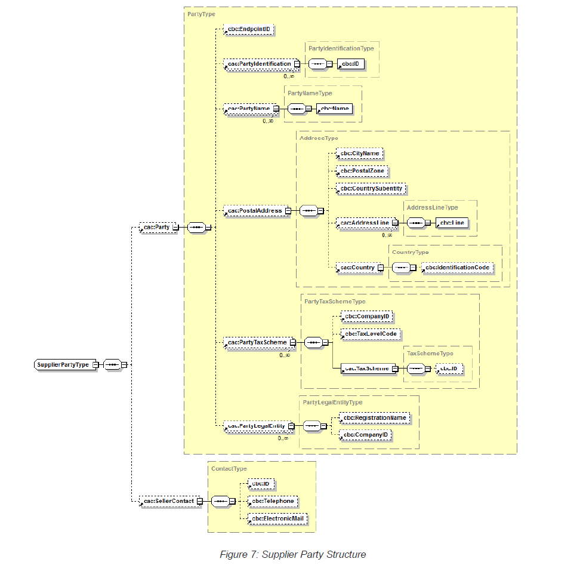
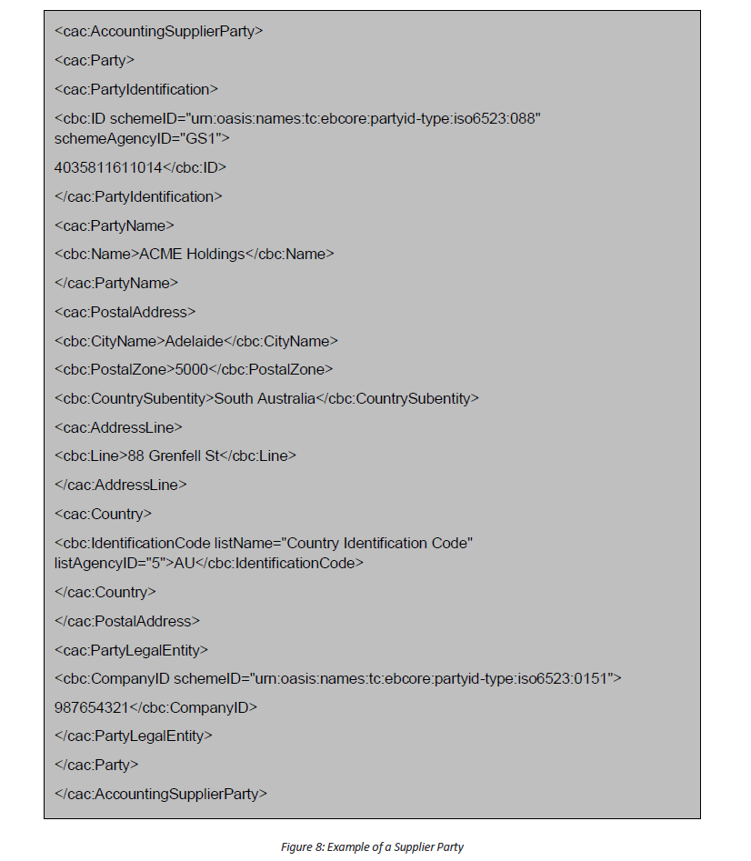
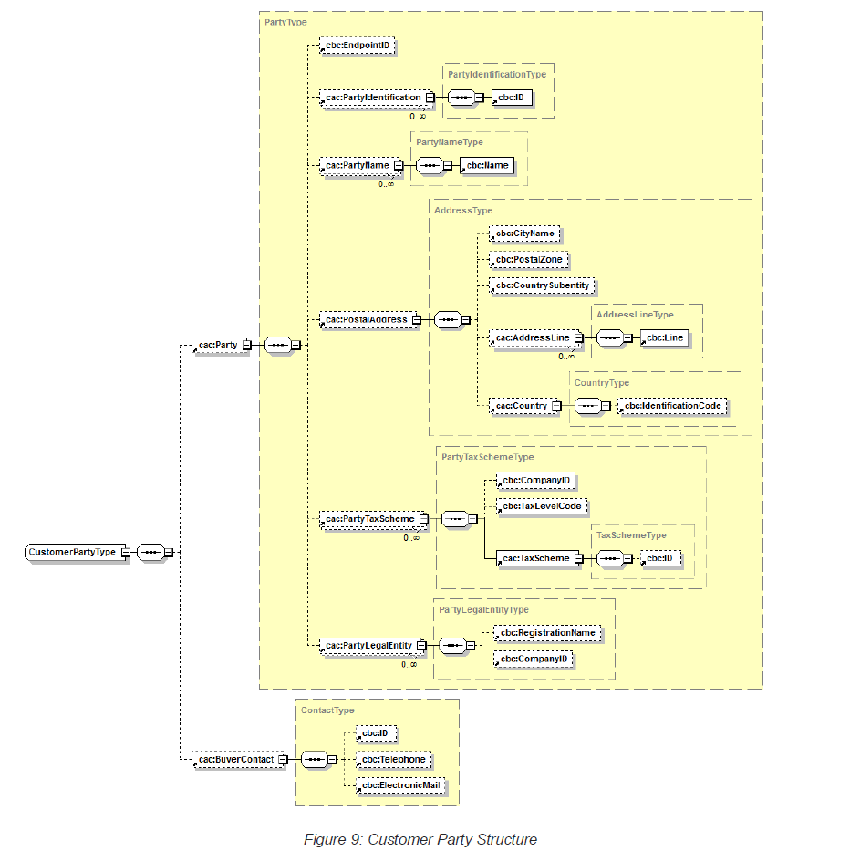
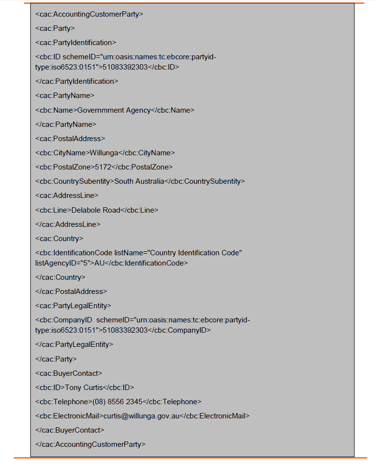
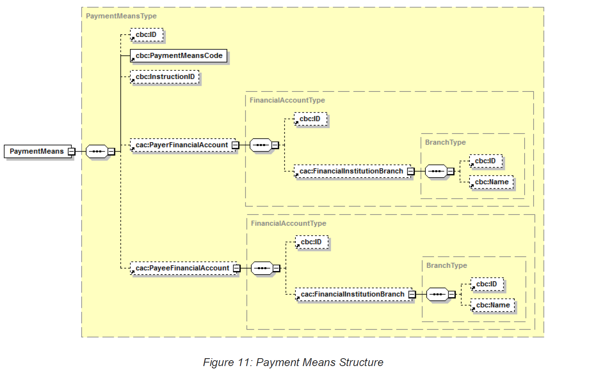
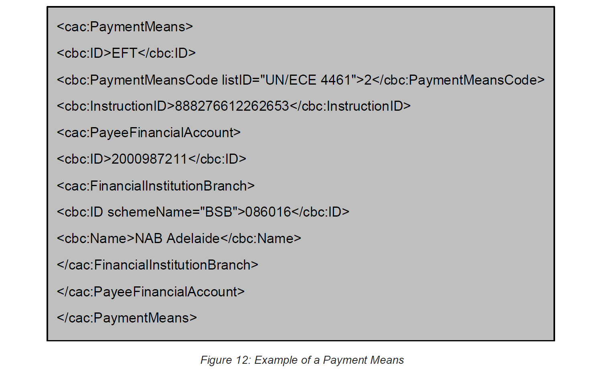

# 8 eInvoicing Profiles (Normative) 

This section defines the Profiles of the Data Formats to be used for XML Document exchanges as part of the eInvoicing process. 

Following from the eInvoicing Semantic Model (Digital Business Council, 2016c) the eInvoicing Profiles has been defined to include only the essential UBL Elements (the Core) that an eInvoicing Document needs to satisfy operational, financial and regulatory (e.g. GST) requirements. 

Core UBL Elements are those that business applications or Service Interfaces must be able to recognise if they appear in a Document. Not all Core UBL Elements need appear in all eInvoice Documents, these are noted as Optional in the Profile. Core UBL Elements noted as Mandatory in the Profile and must appear in every eInvoice Document. 

Using these Core UBL Elements for eInvoices means that businesses are able to: 

  a. Interpret and understand the meaning of the common, essential information on an eInvoice; and 

  b. Inform their software or Service providers to process these Core UBL Elements based on the eInvoicing Semantic Model (Digital Business Council, 2016c). 
  
These Profiles are a conformant subset of the OASIS Universal Business Language (UBL) v2.1 (ISO/IEC 19845:2015) (OASIS UBL TC, 2013). XML Documents conforming to these Profiles also conform to the UBL standard. 

## 8.1 Document Constraints 

All XML Documents must conform the UBL rules for Document constraints (OASIS UBL TC, 2013). Specifically: 

*[IND5] UBL conformant instance documents MUST NOT contain an element devoid of content or containing null values, except in the case of extension, where the UBL Extension Content element is used.*

This means that a Mandatory UBL Element must not be empty. If they appear in an XML Document, Optional Elements must also not be empty. 

And: 

*[IND2] All UBL instance documents MUST identify their character encoding within the XML declaration.*

*[IND3] In conformance with ISO IEC ITU UN/CEFACT eBusiness Memorandum of Understanding Management Group (MOUMG) Resolution 01/08 (MOU/MG01n83) as agreed to by OASIS, all UBL SHOULD be expressed using UTF-8.*

## 8.2 Diagram Notation 

The remainder of this section provides a description of the UBL Elements within the eInvoice Schemas. 

The diagramming notation used has the following key: 

- Mandatory Element 

- Optional Element 

Examples of the use of these Elements are also provided. 

In addition, a tabular version of the mapping between the eInvoicing Semantic Model and UBL is provided in Annex B of the eInvoicing Semantic Model (Digital Business Council, 2016c) and also in the tables available at: 

http://resources.digitalbusinesscouncil.com.au/dbc/documents/core-invoice/summary/core-invoice-01.html 

## 8.3 Core Invoice XML Schema 

The Core Invoice Schema is used for defining the following eInvoicing Document types: 
  
  • Invoice; 
  
  • Recipient Created Tax Invoice (RCTI), and; 

  • Credit Note. 

The specific Document type is identified by the Value of the InvoiceTypeCode Element. 

The remainder of this section walks through the various structures in the Core Invoice Schema. 

The Response Document type is described in Section 8.4. 

### 8.3.1 Invoice Document Type 

The Invoice Element is the top level (often referred to as the root element) of the Invoice. The overall structure is describes in Figure 4. 

### 8.3.2 Document Reference Type 

A Document Reference is a structure used to define a Reference to another Document. 

The structure supports both Documents embedded or included with the Invoice and those referred to at an external URI. 

### 8.3.3 Supplier Party Type 

Both Buyer and Supplier share the same Party structures. 

Within the Core Invoice Schema the Supplier (who claims the payment and is responsible for resolving billing issues and arranging settlement) is identified using the UBL Element AccountingSupplierParty. 

### 8.3.4 Buyer Party Type 

AccountingCustomerParty is the UBL Element used for identifying the Buyer (the Party making settlement relating to a purchase and resolving billing issues). 

*Figure 10: Example of a Customer Party*

### 8.3.5 Payment Means Type 

The Payment Means is the structure used to describe how payments are to be made. 

### 8.3.6 Allowance and Charges Type 

Both Allowances (e.g. discounts) and Charges (e.g. penalties) are described by a common structure with an indicator (ChangeIndicator) to say whether this is a Charge (true) or an Allowance (false). 
