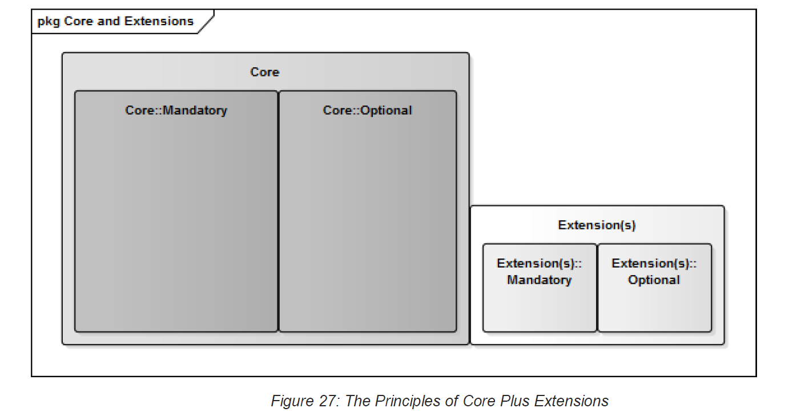

# 13 Extensions to the Core Invoice 

In addition to the Core Invoice Elements, eInvoices may require additional Extension Elements to satisfy specific business requirements. Figure 27 describes the relationship of these principles. 

If an Information Element is required for a specific Business Process (such as an industry sector’s specific Invoicing practices) and it is not defined in the eInvoicing Semantic Model (Digital Business Council, 2016c) then it should be defined as an Extension to the Core. 

An Extension adds to the eInvoicing Semantic Model (Digital Business Council, 2016c) and may include both Mandatory and Optional Information Elements. 
Extensions may be specific to a community (such as the retail supply chain or the healthcare sector) or they may apply to more than one community (such as exporter’s Invoicing internationally). Any of these scenarios may have specific, additional business requirements and the rules that support them could require additional Information Elements not present in the eInvoicing Semantic Model (Digital Business Council, 2016c). 

For consistency and re-use, any Extensions to this Profile specification should be implemented as Extension UBL Elements using either of the following approaches: 

   1. Enabling existing UBL Elements- The underlying data structures used for the Core Invoice are based on the UBL data model (OASIS UBL TC, 2013). This data model defines many other Information Elements that may be used as Extensions to the Core while still remaining compliant. 
An example is given in Annex A.1. An Extension Profile for a UBL Schema (and associated business rules) may be created to describe these additional UBL Elements. Software tools suitable for this purpose are listed in section 12.2. 
These new XML Schema may be registered as new Services within the Framework. 

   2. The UBL standard also supports Extensions to the UBL Schemas. This allows for any type of data (such as Digital Signatures, data in legacy formats, etc.) to be included within a conformant eInvoicing Document. The UBL Customization Methodology defines how to design these Extensions (OASIS UBL TC, 2009) and the UBL Extension Validation Methodology (OASIS UBL TC, 2013) describes how to implement these in a consistent way. An example is given in Annex A.2 showing the addition of an additional business identifier. 
XML Schema and/or business rules describing these UBLExtensions Elements may be registered as new Services within the Council’s Interoperability Framework. 

Only organisations that register Service Interfaces capable of processing these new Services would be expected to be able to process these Extension UBL Elements (see Section 10; Identifying Services for the Interoperability Framework). 

To aid in standardising Extensions, the Council will provide guidance on their governance; for example how to identify, specify and register it for possible re-use by others. 
