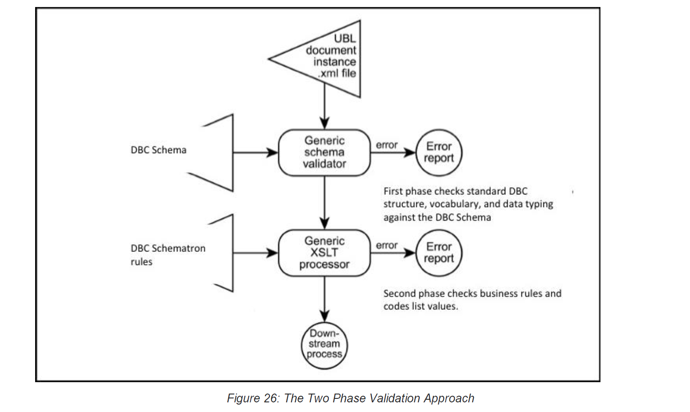

# 11 Validation Artefacts 

Two types of validation artefacts have been provided to support compliance to the eInvoicing Profile that could be used in a few scenarios in the eInvoicing process (detailed below) 

## 11.1 XML Schemas (Normative) 

The eInvoice Document Schemas are conformant subsets of the UBL Schema and should be used to validate the structure of eInvoicing XML Documents. 

Only the eInvoicing Profile XML Schema are considered normative (the official form of validation). All eInvoicing XML Documents must be valid instances of these XML Schema. 

All Information Elements noted as Mandatory in the eInvoicing Semantic Model (Digital Business Council, 2016c) must have Values provided in every eInvoice. The eInvoice XML Schema will validate the existence of (most) mandatory Core Information Elements (see 11.2). 

Optional Core Information Elements need not appear in an eInvoice but will be validated by the XML Schema if they do. 

The eInvoice XML Schema will also check eInvoices for the existence of UBL Elements that are not defined in the Core eInvoice Semantic Model and fail if anything unexpected is found. 

## 11.1.1 Core Invoice (Normative) 

The target namespace for the Core Invoice XML Schema is: 

http://resources.digitalbusinesscouncil.com.au/dbc/einvoicing/doctype/core-invoice/xsd/current 

The target namespace for a runtime version of the Core Invoice XML Schema (without annotations) is: 

http://resources.digitalbusinesscouncil.com.au/dbc/einvoicing/doctype/core-invoice/xsdrt/current 

The UBL 2.1 Invoice (OASIS UBL TC, 2013) on which the Core Invoice XML Schema is based is: 

http://docs.oasis-open.org/ubl/os-UBL-2.1/xsd/maindoc/UBL-Invoice-2.1.xsd 

## 11.1.2 Response (Normative) 

The target namespace for the Response XML Schema is: 

http://resources.digitalbusinesscouncil.com.au/dbc/einvoicing/doctype/response/xsd/current 

The target namespace for a runtime version of the eInvoicing Response XML Schema (without annotations) is: http://resources.digitalbusinesscouncil.com.au/dbc/einvoicing/doctype/response/xsdrt/current 

The UBL 2.1 Application Response (OASIS UBL TC, 2013) on which the Response XML Schema is based is: 

http://docs.oasis-open.org/ubl/os-UBL-2.1/xsd/maindoc/UBL-ApplicationResponse-2.1.xsd 

## 11.2 Schematron Rules (Informative) 

Only the semantics of the business rules as defined in the eInvoicing Semantic Model (Digital Business Council, 2016c) are normative. The technologies for how they are validated are not mandated by this specification. 

A set of informative Schematron (Schematron, 2004) test rules have been provided that may be used to validate Core Business Rules that are not checked by the XML Schema. 

Each is labelled with reference to the Business Rule identified in the eInvoicing Semantic Model (Digital Business Council, 2016c). 

The Schematron rules are provided as informative tools to encourage consistent validation of eInvoicing XML Documents against the business rules defined in the eInvoicing Semantic Model (Digital Business Council, 2016c). However other technologies are available and may be used to validate these business rules. 

The target namespaces for the eInvoicing Schematron Rule validation artefacts are: 
    
   • Invoicing: 
  
  http://resources.digitalbusinesscouncil.com.au/dbc/einvoicing/process/invoicing01/schematron/current 
    
   • Recipient Created Tax Invoicing:
   
   http://resources.digitalbusinesscouncil.com.au/dbc/einvoicing/process/invoicing03/schematron/current 
    
   • Adjustment Invoicing: 
  
  http://resources.digitalbusinesscouncil.com.au/dbc/einvoicing/process/invoicing05/schematron/current 
  

## 11.3 Two Phase Validation 

The two sets of artefacts described in Sections 11.1 and 11.2 may be used in a two-phase validation process as shown in Figure 26. 

  

## 11.4 Validating Coded Values 

To aid interoperability and avoid ambiguity it is sometimes useful to use Coded sets of possible Values for Information Elements. 
Examples are Currencies, Countries, etc. 

In some cases standardised Code sets are Mandatory and must be used. The following table identifies the Code sets for implementing the eInvoicing Documents. 

To validate the use of specific Code sets against Values in UBL Elements the following approach is supported (but not mandated): 

   1. A Genericode standard for Code list representation is used to specify sets of enumerated Values, be they Codes or identifiers or any other set of Values. 

   2. A Context/Value Association (CVA) file (OASIS UBL TC, 2013) specifies the relationship of information items in Document contexts to both external enumerations of Values allowed for each item and to arbitrary evaluations processed for each item. 

The Distribution Package contains Genericode and associated CVA files for validating the Code lists specified in Table 7. 

*Table 7: Mandatory Code Lists*

| | | | | |
| --- |------- | --- |------- |----- |
**Information Element** |**UBL Element**|**Definition**| **Applicable Code List**| **Mandatory Code Values**|
Document Type Code | cbc:InvoiceTypeCode | A Code signifying the Type of the Document. | UNECE TRED 1001 (customised) | [Document Type Codes](http://digitalbusinesscouncil.com.au/dbc/einvoicing/code/documenttype/gc/current) |
Invoice Currency Code | cbc:DocumentCurrencyCode | A Code signifying the default Currency for this Document. | ISO 4217 | [Currency Codes](http://docs.oasis-open.org/ubl/os-UBL-2.1/cl/gc/default/CurrencyCode-2.1.gc) |
Amount Currency Code | …/cbc:Amount@currencyID | A Code signifying the Currency for an Amount. | ISO 4217 | [Currency Codes](http://docs.oasis-open.org/ubl/os-UBL-2.1/cl/gc/default/CurrencyCode-2.1.gc) |
Country Code | .../cac:Address/cac:Country/cbc:IdentificationCode | A Code signifying a Country. | ISO 3166-1. | [Country Codes](http://docs.oasis-open.org/ubl/os-UBL-2.1/cl/gc/default/CountryIdentificationCode-2.1.gc) |

*Table 8: Optional Code Lists*

| | | | | |
| --- |------- | --- |------- |----- |
**Information Element** |**UBL Element**|**Definition**| **Applicable Code List**| **Optional Code Values**|
Allowance Reason Code | …/cac:AllowanceCharge/cbc:AllowanceChargeReasonCode | A mutually agreed Code signifying the reason for this Allowance. | Mutually agreed by trading partners. | [Allowance Charge Reason Codes](http://docs.oasis-open.org/ubl/os-UBL-2.1/cl/gc/default/AllowanceChargeReasonCode-2.1.gc) |
Charge Reason Code | .../cac:AllowanceCharge/cbc:AllowanceChargeReasonCode | A mutually agreed Code signifying the reason for this Charge. | Mutually agreed by trading partners. | [Allowance Charge Reason Codes](http://docs.oasis-open.org/ubl/os-UBL-2.1/cl/gc/default/AllowanceChargeReasonCode-2.1.gc) |
Item Classification Code | cac:InvoiceLine/cac:Item/cac:CommodityClassification/cbc:ItemClassificationCode | A Code signifying the trade classification of the commodity. | Mutually agreed by trading partners. | [Item Classification Codes](http://docs.oasis-open.org/ubl/os-UBL-2.1/cl/gc/special-purpose/ItemClassificationCode-2.1.gc) |
GST Category Tax Code | .../cac:TaxScheme/cbc:TaxTypeCode | A Code signifying the Tax level applicable within a Taxation scheme. | Dependent on the specific Tax Scheme. | |
Response Code | …/cac:Response/cbc:ResponseCode | A code signifying the type of Response. | Mutually agreed by trading partners. | |
Status Reason Code | …/cac:Status/cbc:StatusReasonCode | A Code that describes the issue and nature of the status. | Council defined Values (to be defined). | [Status Reason Codes](http://docs.oasis-open.org/ubl/os-UBL-2.1/cl/gc/special-purpose/StatusCode-2.1.gc)|

### 11.4.1 References to Applicable Code Lists 

   • UNECE TRED 1001, Document Name code 
   
   • http://www.unece.org/fileadmin/DAM/trade/untdid/d15b/tred/tred1001.htm 
   
   • ISO 3166-1, Codes for the representation of Names of countries and their subdivisions — Part 1: Country Codes (alpha-2 representation) https://www.iso.org/obp/ui/#search 
   
   • ISO 4217, Codes for the representation of Currencies (alpha-3 representation) http://www.currency-iso.org/en/home/tables/table-a1.html 
   
   • UNECE TRED 4461, Payment Means Code http://www.unece.org/trade/untdid/d04a/tred/tred4461.htm 
   
   • UNECE TRED 4343, Response type, coded 

   • http://www.unece.org/fileadmin/DAM/trade/edifact/code/4343cl.htm 

