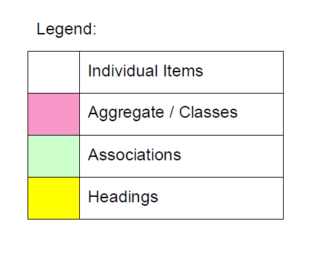
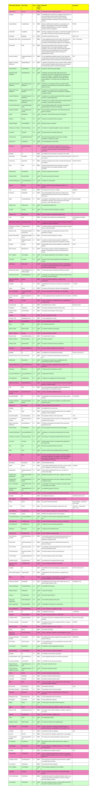

# ANNEX B: eInvoicing Semantic Model in a Tabular Format

The following pages describe the elements within the eInvoicing Semantic Model in tabular form. These have been mapped to the UBL 2.1 Data Model and the equivalent terms mapped. (Note – The methodology and terminology used is taken from CCTS (UN/CEFACT, 2003)).

The rows with a pink background denote aggregations of Information Elements (ABIEs).

The rows with a white background denote basic Information Elements (BBIEs).

The rows with a green background denote associations between aggregations of Information Elements (ASBIEs).

The occurrence (cardinality) of these Information Elements is given as one of the following:

 - 1 – means the Information Element is mandatory and must have only one occurrence;

 - 1..n – means the Information Element is mandatory and may have more than one occurrence.

 - 0..1 – means the Information Element is optional and if used may have only one occurrence; or

 - 0..n – means the Information Element is optional and if used may have one or more occurrences;
 
 
 
 
 
 
