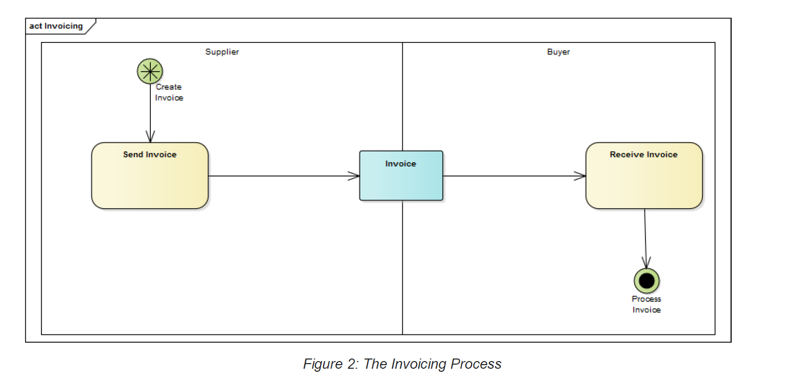

# 8 Business Processes 

## 8.1 Invoicing 

This represents the most common Invoicing process, where a Supplier (Accounts Receivable) issues an Invoice to a Buyer of goods or services (Accounts Payable). 

An Invoice is a Document notifying an obligation to make a Payment, whereas a Tax Invoice is a Document that contains the information about a Taxable supply required by the Goods and Services Tax Act (1999) (Australian Government, 1999). The eInvoicing Semantic Model caters for the requirements of a Tax Invoice. References to Invoice should be assumed to encompass the Tax Invoice. 

Figure 2 describes the flow of the Invoicing process. 

### 8.1.1 Recipient Created Tax Invoicing (RCTI) 

Recipient Created Tax Invoicing is a specialised type of Invoicing process. With Recipient Created Tax Invoicing a Tax Invoice is issued by the Party that receives the goods and services (normally the Buyer), rather than the Supplier (Australian Government, 1999). 

For example, a sugar cane farmer and a mill have entered into an agreement that the Buyer will Invoice and provide Payment for a delivery of cane based on the quality of the cane. On a delivery of cane to the mill, the Buyer creates a RCTI. 

## 8.2 Adjustment Invoicing 

After an Invoice is created, it is sometimes necessary to adjust the information. For example, an adjustment may be needed when: 

There is an error in the relevant Invoice, for example it is to the wrong Buyer, at the wrong time or the wrong amount was charged; 

The Amount of the original Invoice no longer reflects the amount the Buyer owes, for example due to Items being returned or a dispute about Items provided; or 

The supply becomes Taxable or stops being Taxable. 

This process is described in Figure 4. The two common processes for adjustment Invoicing are described below. 

### 8.2.1 Credit Notes 

The Supplier may create and issue a Credit Note that acts as a ‘negative Invoice’ to offset a previous Invoice. 

Credit Notes may also be known as Adjustment Notes for Tax reporting purposes (Australian Government, 1999) and ATO GST ruling GSTR 2013/2 (Australian Government, 2013); and 

### 8.2.2 Copy, Duplicate and Replacement Invoices 

After an Invoice has been received, additional versions of the Invoice may be sent: 

A copy of the original Invoice may be sent; 

A duplicate Invoice may be sent accidentally; and 

A replacement Invoice, with different details, may be sent to replace an existing Invoice. 

## 8.3 Acknowledging Invoices 

With an eInvoicing process it is not uncommon for the recipient (e.g. Buyer) to respond to the eInvoice by sending an acknowledgement in the form of a Response document. Figure 5 describes the flow of a common eInvoicing process with an acknowledgement. 

Responses may also be sent to acknowledge Recipient Created Tax Invoices and adjustment Invoices. 

## 8.4 Business Requirements 

An Invoice needs to support a number of related business functions. The eInvoicing Semantic Model supports: 
   
- Tax reporting; 

    - Conforming to the Goods and Services Tax Act (1999) (Australian Government, 1999). 
  
- Verification; 

    - Allowing identification of the commercial transaction covered by the Invoice. 

- Matching; and 

    - Matching against known accounts payable information, such as purchase order numbers. 
 
- Payment; 
   
   - Specifying how payments are to be made.
   
Other requirements such as international (cross border) Invoicing or Invoice routing within organisations or networks may be considered as Extensions to these Core requirements. 

The table below identifies the eInvoicing Semantic Model Core business requirements and the Mandatory and Optional rules that support them. Note that some Extension requirements are also shown to provide examples. 

*Table3: Core Business Requirements and Rules for Tax Invoices*

**Requirement:** All Tax Invoices shall contain the minimum information stated in section 29-70 of the GST Act (Australian Government, 1999) and explained in Goods and Services Tax Ruling GSTR 2013/1 (Australian Government, 2013). 

| | |
| ---| ----|
**Rule**| **Mandatory** |
| 1. An Invoice of more than $82.50 (including GST) to a GST-registered Buyer MUST be a Tax Invoice. | X |

**Requirement:** A Tax Invoice shall identify that the Document is intended to be a Tax Invoice or a Recipient Created Tax Invoice. 

| | |
| ---| ----|
**Rule**| **Mandatory** |
|2. An Invoice MUST contain a Document Type Code. | X |

**Requirement:** An adjustment note or a recipient created adjustment note shall use the terms to identify the document as described in GST Ruling GSTR 2013/2 paragraph 31 (Australian Government, 2013) 

| | |
| ---| ----|
**Rule**| **Mandatory** |
| 3. An Invoice MUST contain a Document Type Code indicating it is an adjustment document. | X |

**Requirement:** A Tax Invoice shall identify the Supplier. 

| | |
| ---| ----|
**Rule**| **Mandatory** |
|4. An Invoice MUST contain the Supplier’s Business Name or the ABN of the Supplier. | X |

**Requirement:** A Tax Invoice for sales of $1,000 or more shall contain a Buyer’s GST Identifier. 

| | |
| ---| ----|
**Rule**| **Mandatory** |
| 5. An Invoice with a Total Amount greater than $1000 MUST have either the Buyer's Business Name or the ABN of the Buyer. | X |

**Requirement:** Tax Invoices issued by GST branches of Suppliers shall contain have the ABN plus the GST branch number on the Tax invoice (Australian Government, 1999). 

| | |
| ---| ----|
**Rule**| **Optional** |
| 6. An Invoice MAY contain the ABN plus a GST branch number for Suppliers with GST branches registered with the ATO. | X |

**Requirement:** A Tax Invoice shall identify the date the Invoice was issued. 

| | |
| ---| ----|
**Rule**| **Mandatory** |
|7. An Invoice MUST contain an Invoice Issue Date. | X |

**Requirement:** A Tax Invoice shall contain a brief description of the items sold.

| | |
| ---| ----|
**Rule**| **Mandatory** |
| 8. An Invoice Line MUST have a Description. | X |

