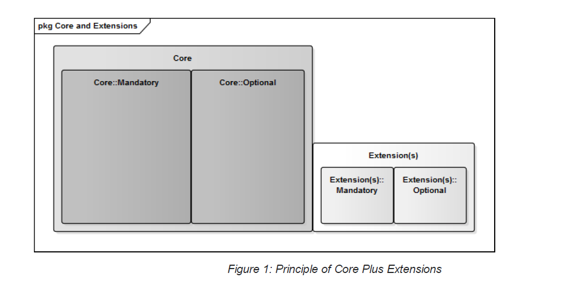

# 5 The Core Invoice Concept 

A semantic model is based on the idea that the common pieces of information used in an Invoice may have many labels, use different terminology and be expressed in different ways, but the meanings are commonly understood. Semantic models help us identify what the equivalent pieces of information are without the distraction of how they are expressed. This is similar to how drawing pictures helps people who don’t speak a common language to communicate. 

Establishing a common framework for business information systems with respect to the exchange of Invoices is challenging for the following reasons: 

   1. The overall business environment is very diverse and consequently so is the information that needs to be exchanged between business partners; 

   2. Documents such as Invoices consist of many Information Elements. Attempting to define and standardise all possible occurring Information Elements would generate a very large and complex information model that no single organisation could implement entirely; 
   
   3. Even if a complete implementation of such a large model were possible, its implementation across the business environment would be very challenging and costly; and 4. As experience informs us, business partners in various industry sectors will agree on subsets of the model that are supported by their business information systems. Such variety would work against the principles of using common standards, jeopardise interoperability and result in expensive implementation projects. 
   
   4. As experience informs us, business partners in various industry sectors will agree on subsets of the model that are supported by their business information systems. Such variety would work against the principles of using common standards, jeopardise interoperability and result in expensive implementation projects. 

This Specification uses a different approach. In contrast to collecting and meeting the requirements of all businesses, the eInvoicing Semantic Model is defined as including only the essential Information Elements (the ‘Core’) that an eInvoice needs to satisfy operational, financial, and regulatory (e.g. GST) requirements. 

Using the eInvoicing Semantic Model should mean that business partners are able to: 

   a. Interpret and understand the meaning of information on an eInvoice; and 

   b. Inform their Invoice processing software providers to process Data Formats using the Information Elements in the eInvoicing Semantic Model. 

The eInvoicing Semantic Model makes no assumption about the method by which an Invoice is created, delivered and processed. For example the eInvoice may be processed by business partners or by an intermediary service provider. 

The eInvoicing Semantic Model also makes no assumption about the Data Format, syntax or transmission technology used. However in the Council’s eInvoice Interoperability Framework the model is applied to a specific Data Format (UBL) (OASIS UBL Technical Committee, 2013). 

## 5.1 Design Principles 

The eInvoicing Semantic Model has been designed using the principle of a Core set of business requirements, rules and their supporting Information Elements. 

These Core Information Elements are those that business applications must be able to recognise if they appear in an eInvoice. Not all Core Information Elements will appear in all eInvoices, these are noted as Optional. Core Information Elements noted as Mandatory must appear in every eInvoice. 

In addition, most eInvoices will require additional Extension Information Elements to satisfy their specific business requirements (see Section 5.2). Figure 1 describes the relationship of these principles. 

The set of Information Elements that are contained in the Core eInvoicing Semantic Model can be seen as determined by regulation (such as taxation and evidentiary legislation) or by common business practice. 

The regulatory part of the eInvoicing Semantic Model supports the observance of both Tax policies and commercial law pertaining to electronic invoicing commonly in force throughout Australia. For example, the ‘A New Tax System Act’ (1999) (Australian Government, 1999) specifies the minimum set of criteria for a Tax Invoice. 

The eInvoicing Semantic Model also identifies the business requirements and rules for commonly occurring Information Elements that are not industry, sector or regionally specific. 

The eInvoicing Semantic Model builds on the work of the European standard’s agency CEN and the OpenPEPPOL Association. 

CEN Technical Committee 434 (Electronic Invoicing) has drafted ‘Electronic Invoicing - Semantic Data Model of the Core Information Elements of an Electronic Invoice’ (CEN Technical Committee 434, 2016). This European model has been adapted for an Australian context. (Note - as of March 2016 the CEN publication draft has been reviewed and is now subject to modification following comments received). 

Similar to the approach of PEPPOL, the eInvoicing Semantic Model has been mapped to a subset of the standard UBL data model (OASIS UBL Technical Committee, 2013)(see Annex B). This approach will simplify the transformation to the recommended Data Format and support alignment with other international eInvoicing programmes. 

## 5.2 Usage and Extension 

If an Information Element is required for a specific Business Process (such as an industry sector’s specific Invoicing practices) and it is not defined in the Core eInvoicing Semantic Model then it should be defined as an Extension to the Core. 

An Extension adds to the eInvoicing Semantic Model and may include both mandatory and optional Information Elements. It is possible to define Extension Information Elements while still conforming to the eInvoicing Semantic Model (see Figure 2 - Principle of Core plus Extensions). 

Extensions may be specific to a community (such as a large retailer’s supply chain or the healthcare sector) or they may apply to more than one community (such as exporter’s invoicing internationally). Any of these scenarios may have specific business requirements and the rules that support them could require additional Information Elements not present in the Core eInvoicing Semantic Model. 

To assist in standardising the use of Extensions the underlying data structures used for the Core eInvoicing Semantic Model are based on the UBL data model (OASIS UBL Technical Committee, 2013). This data model defines many other Information Elements that may be used as Extensions to the Core while still remaining compliant. Furthermore the UBL Customization Methodology defines how to apply these extensions to the core model in a consistent way (OASIS, 2009). 

Only Parties that agree to these Extensions would be expected to be able to process these Extension Information Elements. 

To aid in standardising Extensions the Council will provide guidance on their governance, for example how to specify an Extension to the eInvoicing Semantic Model and register it for possible re-use by others. 

