# 9 The eInvoicing Semantic Model (Normative)

## 9.1 Introduction

As noted earlier the eInvoicing Semantic Model uses the principle of a ‘Core’ set of Information Elements that business applications must be able to recognise if they appear in an eInvoice Document. Not all Core Information Elements will appear in all eInvoices, these are noted as optional. Core Information Elements noted as mandatory must appear in every eInvoice.

In addition, most Invoices will also require additional ‘Extension’ Information Elements to satisfy their business requirements (see Section 5.2). Figure 1 (p8) describes the relationship of these principles.

In the following sections the eInvoicing Semantic Model has been graphically expressed. The same structures are also described in tabular form in Annex B.

A key to reading the following diagrams is provided in Figure 7 below. (Note - The style used is based on the Class Diagram notation of the Unified Modeling Language Class Diagram notation (Object Management Group, 2015)).

The occurrences of sub-structures and their Information Elements is defined using one of the following notations:

 -  1..1 (or no occurrence stated) – means the Information Element is mandatory and must have only one occurrence;
 
 - 1..n – means the Information Element is mandatory and may have more than one occurrence;

 - 0..1 – means the Information Element is optional and if used may have only one occurrence; and

 - 0..n – means the Information Element is optional and if used may have one or more occurrences.
 
## 9.2 Core Invoice Model

At the highest level an Invoice comprises of several substructures. These have been identified as:
 
 - Document References;

   - Such as references to orders, delivery dockets, contracts, etc.

 - Supplier details;

   - Such as identifiers, address and contact details for the Supplier.
 
 - Buyer details;
   
   - Such as identifiers, address and contact details for the Buyer.
 
 - Payment information;

   - Details of how payments may be made.

 - Allowance and Charges;

   - Such as discounts, penalties, or additional charges.

 - Monetary totals;
 
   - Such as invoice totals and actual amounts payable.
 
 - Tax totals;

   - Such as details of the GST breakdown.

 - Invoice Line details; and

   - Details of individual transactions within the Invoice.

 - Item details.

   - Such as identifiers, price and descriptions or the Items invoiced.

In a presentational format these can be demonstrated by the simplified example shown in Figure 8 below.

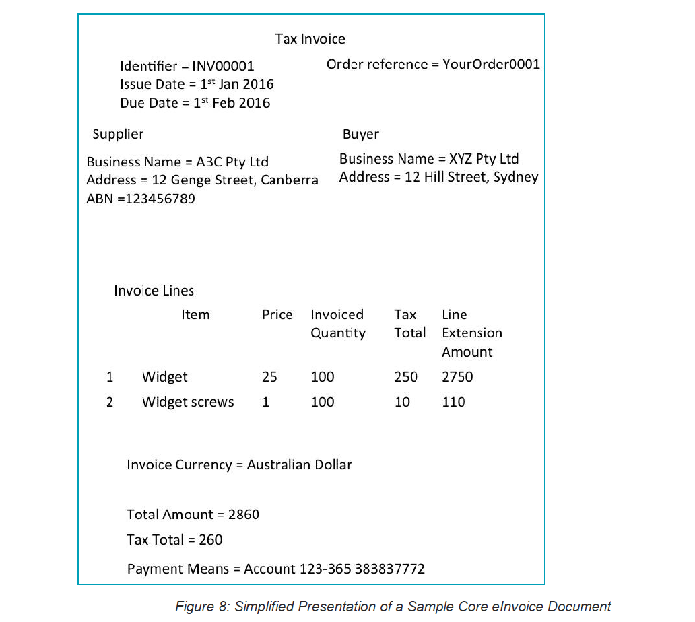

As noted above, detailed descriptions of the Information Elements are provided in tabular form in Annex B and as diagrams throughout the remainder of this section.

Figure 9 (below) illustrates the overall structure of the Invoice and its sub-structures as a high level view. By starting at the box on the left hand side, labelled ‘Invoice’, it is possible to identify the substructures contained in the Core of an Invoice.

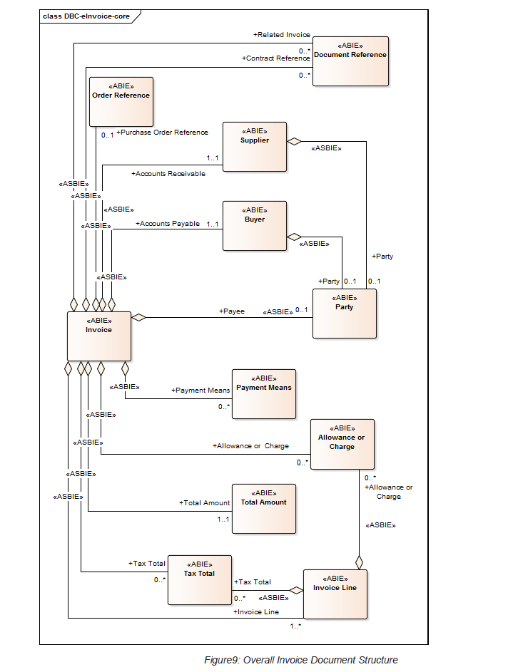

As a guide it can be noted from this diagram that only the Accounts Receivable (Supplier), Accounts Payable (Buyer), Total Amount and Invoice Lines are Mandatory for the Core Invoice. In fact, the complete set of mandatory Information Elements within the Core eInvoice Semantic model are:

Invoice. Identifier
Invoice. Issue Date
Invoice. Type Code
Accounts Receivable (Accounting. Supplier Party)
Accounts Payable (Accounting. Buyer Party)
Total Amount. Payable Amount
Invoice Line. Identifier
Invoice Line. Line Extension Amount
Invoice Line. Item

All other Information Elements within the eInvoice Semantic model are optional.

The remainder of this section breaks down each of the Core Invoice sub-structures into their basic Information Elements together with any associations to other sub-structures.

### 9.2.1 Invoice Structure

The Invoice structure is the top level (often referred to as the header) of the Invoice. The diagram below describes the Invoice level Information Elements and any associations not covered by subsequent diagrams.

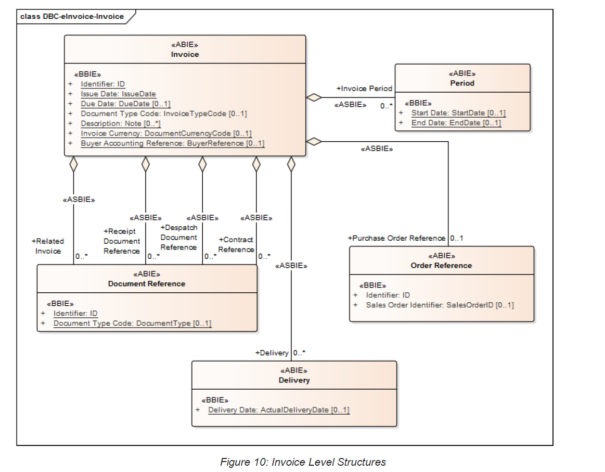

### 9.2.2 Document Reference Structure

A Document Reference is a structure used to define a Reference to another Document.

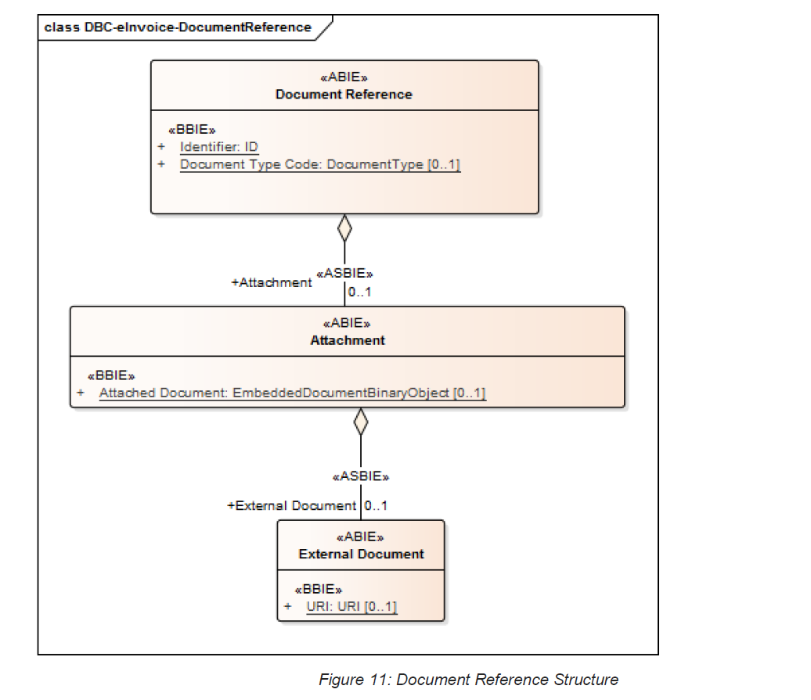

The structure supports both Documents embedded or included with the Invoice and those referred to at an external Location.

### 9.2.3 Supplier Structure

In the eInvoicing Semantic Model the Supplier is performing the role of Accounts Receivable who claims the Payment and is responsible for resolving billing issues and arranging settlement.

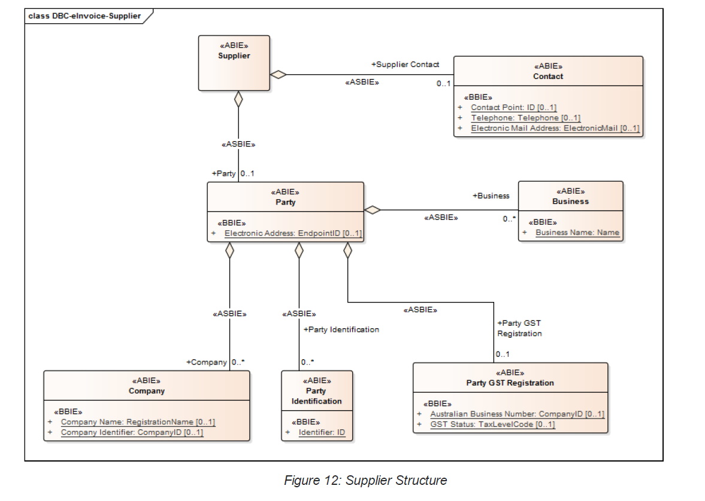

### 9.2.4 Buyer Structure

Accounts Payable is the role performed by a Buyer Party when making settlement relating to a purchase and resolving billing issues.

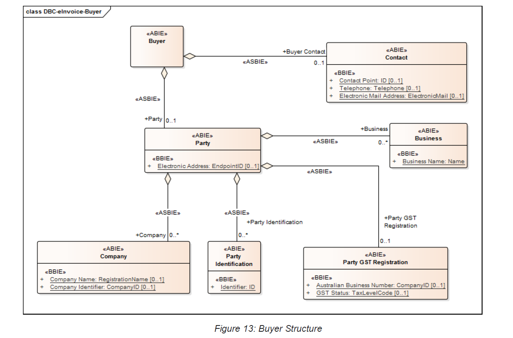

### 9.2.5 Party Structure

A Party is an individual, a group or an organisation, business, company, authority, agency or any trading entity having a role in a Business Process. Bother Buyer and Supplier share the same Party structures.

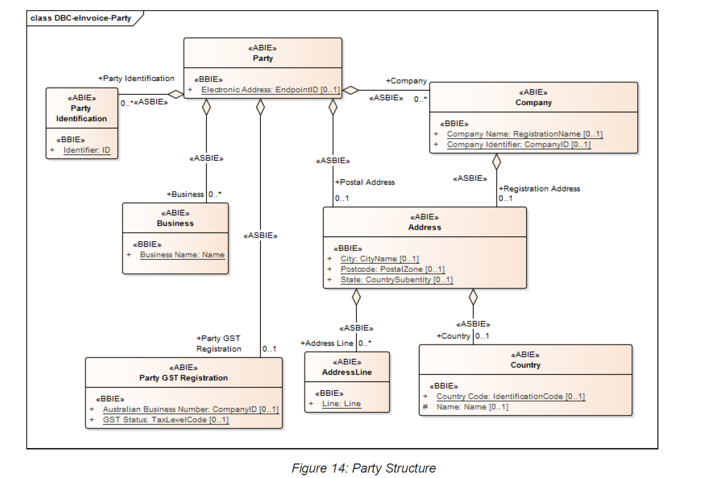

### 9.2.6 Payment Means Structure

The Payment Means is the structure used to describe how Payments are to be made.

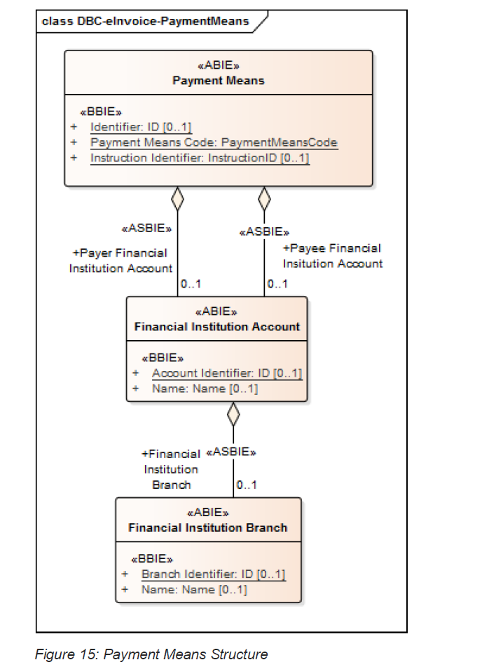

### 9.2.7 Allowance and Charges Structure

Both Allowances (e.g. discounts) and Charges (e.g. penalties) are described by a common structure with an indicator to say whether this is a Charge or an Allowance.

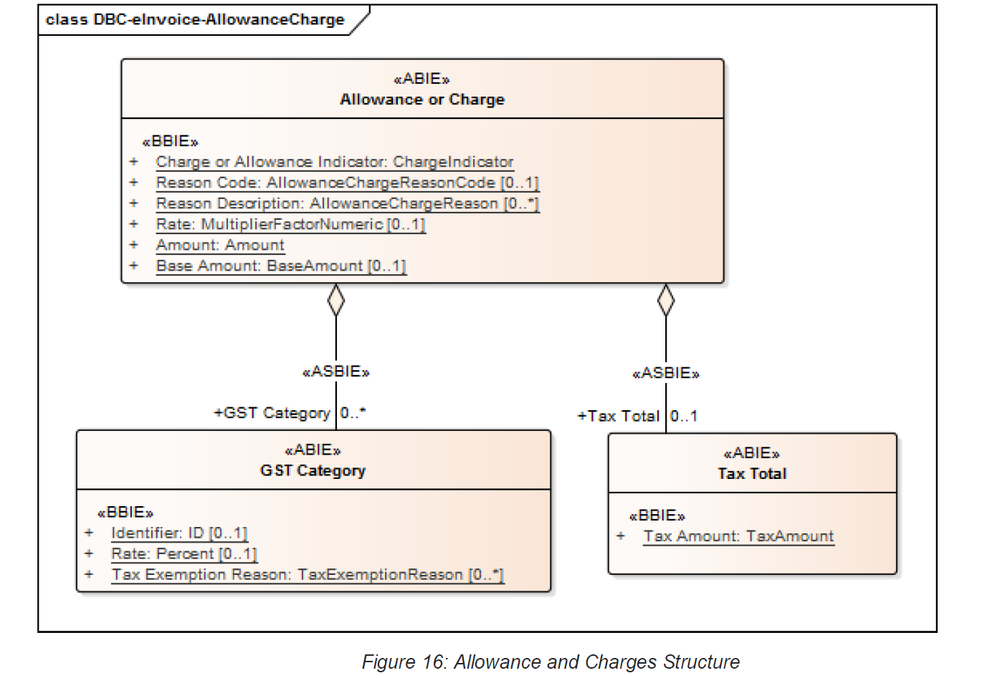

### 9.2.8 Monetary Total Structure

The overall Amount to be paid is described using a monetary total structure.

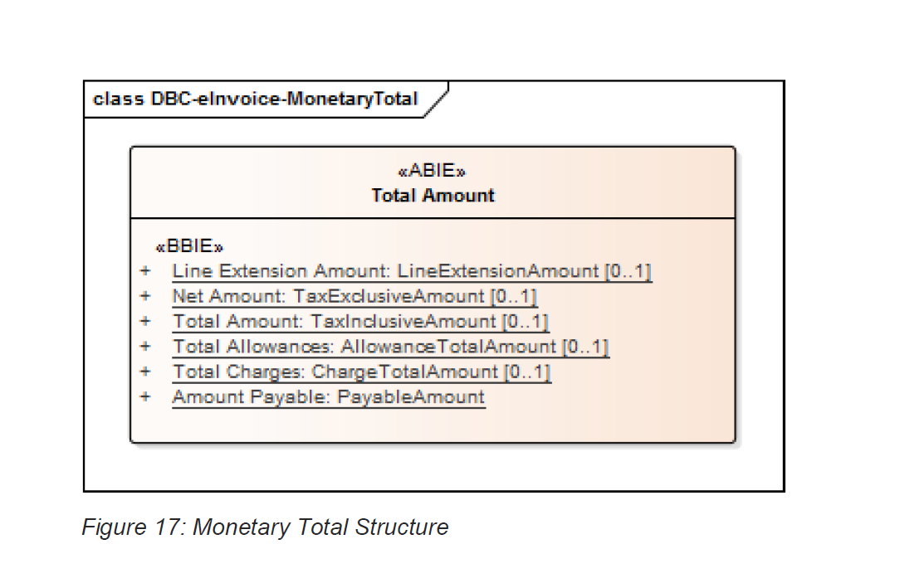

### 9.2.9 Tax Total Structure

The overall Taxes involved are described using the Tax Total structure.

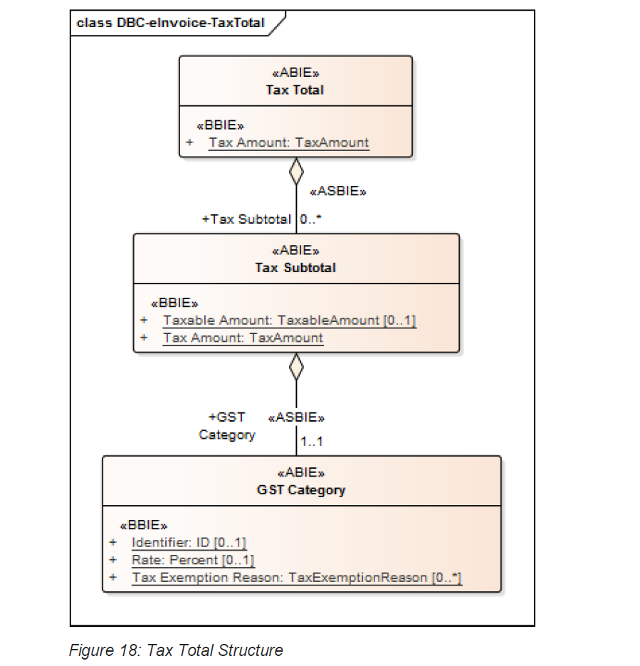

Multiple Taxes (for example, additional GST Categories) and their subtotals are supported.

### 9.2.10 Invoice Line Structure

Charges for individual Items or transactions are often described as ‘lines’ on an Invoice. The Invoice Line structure describes the attributes of an individual invoiced Item.

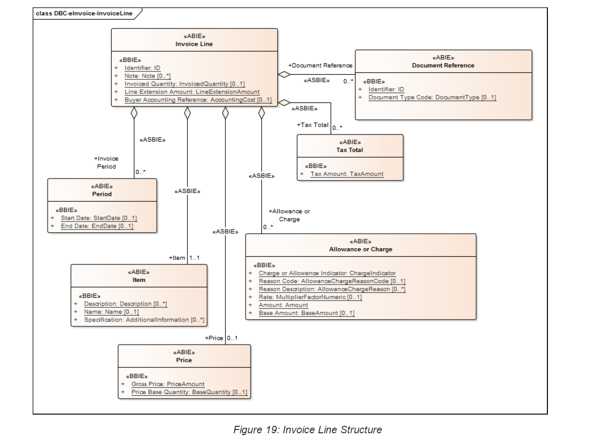

### 9.2.11 Item Structure

The Item structure describes an Item of trade. It includes a generic Name and Description applicable to all examples of the Item together with various methods of uniquely identifying the Item.

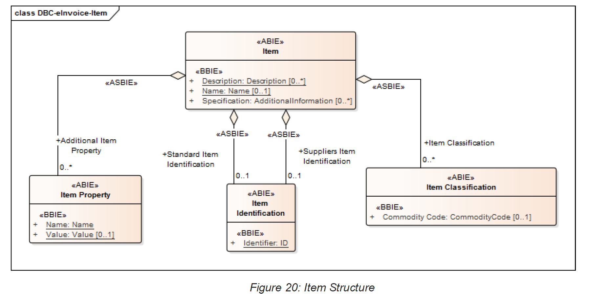

Items can be identified and described by various (optional) Item Identification schemes and Properties, and classified using various (optional) Item Classification schemes.

## 9.3 Credit Note Model

The Credit Note model has the same structure as the Invoice model with the Document Type Code used to indicate its function.

## 9.4 Response Model

If the Business Process requires a response to acknowledge the receipt of an eInvoice then a Response Document with the following structure is returned to the sending Party by the recipient. Recipients will typically be the Buyer (for Invoices and Credit Notes) or the Supplier (for Recipient Created Tax Invoices).

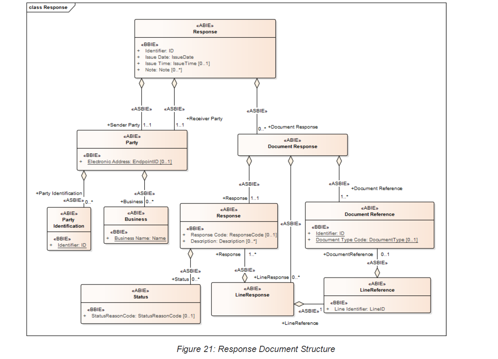

