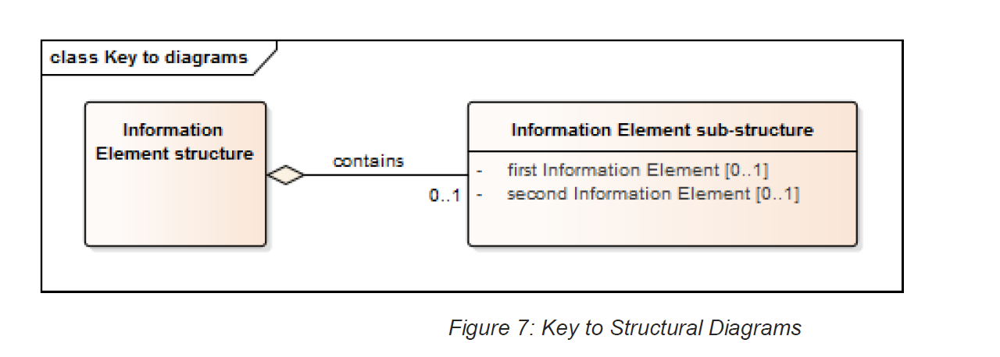

# 9 The eInvoicing Semantic Model (Normative)

## 9.1 Introduction

As noted earlier the eInvoicing Semantic Model uses the principle of a ‘Core’ set of Information Elements that business applications must be able to recognise if they appear in an eInvoice Document. Not all Core Information Elements will appear in all eInvoices, these are noted as optional. Core Information Elements noted as mandatory must appear in every eInvoice.

In addition, most Invoices will also require additional ‘Extension’ Information Elements to satisfy their business requirements (see Section 5.2). Figure 1 (p8) describes the relationship of these principles.

In the following sections the eInvoicing Semantic Model has been graphically expressed. The same structures are also described in tabular form in Annex B.

A key to reading the following diagrams is provided in Figure 7 below. (Note - The style used is based on the Class Diagram notation of the Unified Modeling Language Class Diagram notation (Object Management Group, 2015)).

The occurrences of sub-structures and their Information Elements is defined using one of the following notations:

 -  1..1 (or no occurrence stated) – means the Information Element is mandatory and must have only one occurrence;
 
 - 1..n – means the Information Element is mandatory and may have more than one occurrence;

 - 0..1 – means the Information Element is optional and if used may have only one occurrence; and

 - 0..n – means the Information Element is optional and if used may have one or more occurrences.
 
## 9.2 Core Invoice Model

At the highest level an Invoice comprises of several substructures. These have been identified as:
 
 - Document References;

   - Such as references to orders, delivery dockets, contracts, etc.

 - Supplier details;

   - Such as identifiers, address and contact details for the Supplier.
 
 - Buyer details;
   
   - Such as identifiers, address and contact details for the Buyer.
 
 - Payment information;

   - Details of how payments may be made.

 - Allowance and Charges;

   - Such as discounts, penalties, or additional charges.

 - Monetary totals;
 
   - Such as invoice totals and actual amounts payable.
 
 - Tax totals;

   - Such as details of the GST breakdown.

 - Invoice Line details; and

   - Details of individual transactions within the Invoice.

 - Item details.

   - Such as identifiers, price and descriptions or the Items invoiced.

In a presentational format these can be demonstrated by the simplified example shown in Figure 8 below.
